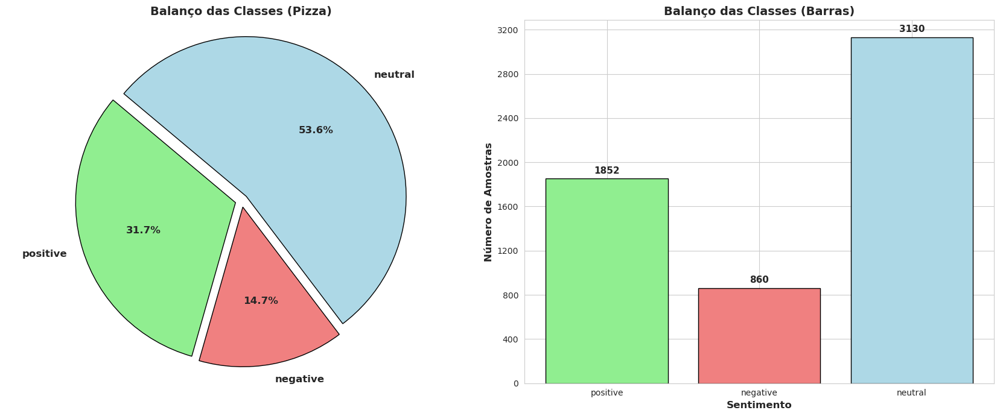
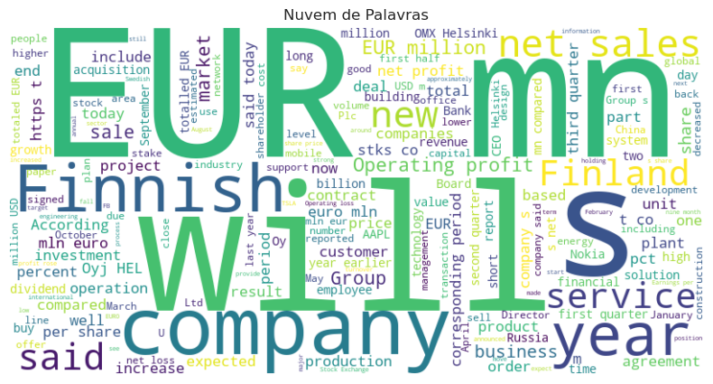
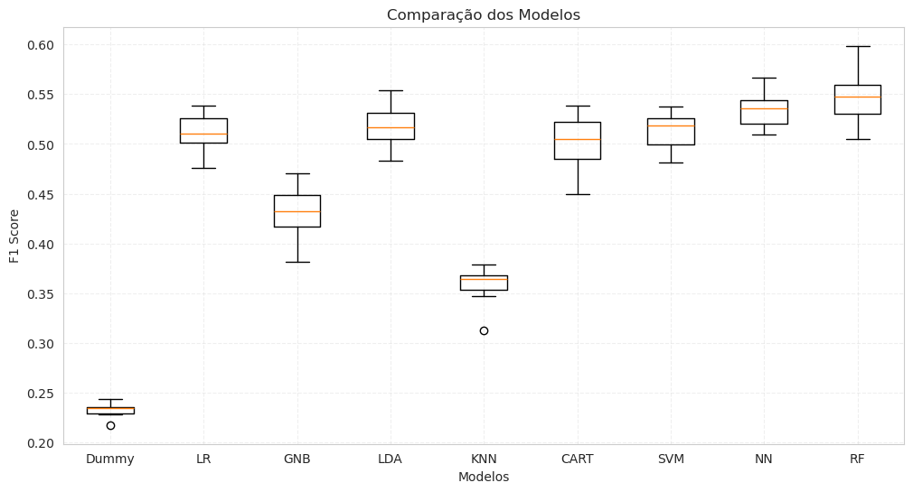
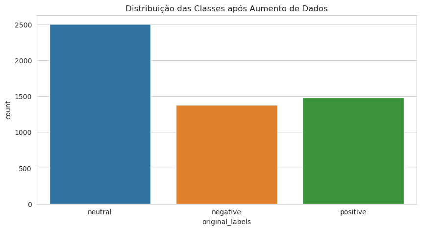
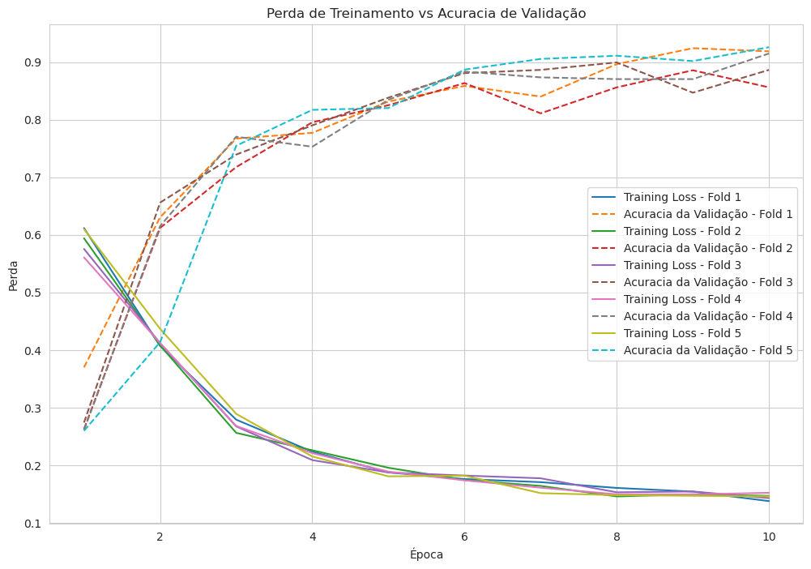
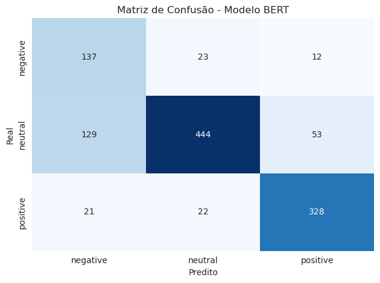

# DemoDay Desafio 2

Este é um projeto do Mandacaru.dev, em que fazemos uma análise e classificação do dataset "Financial Sentiment Analysis" disponível em: https://www.kaggle.com/datasets/sbhatti/financial-sentiment-analysis.
## Abordagem clássica em aprendizado de máquina:

### Análise Exploratória de Dados: 
A análise exploratória de dados é uma parte fundamental do processo de análise de dados, para isso usamos, diversos atributos e visualizações das distribuições por classe, assim como testes de hipotese para verificar o que realmente importa na classificação.

### Pré-processamento dos dados

O pré-processamento dos dados é uma parte fundamental do NLP, para o tratamento dos nossos dados iremos usar: 

1 - Remoção de linhas nulas/vazias. 
2 - Remoção de alfanuméricos (Exceto ! e ? por carregarem informação relevante). 
3 - Remoção de pontuações e stopwords. 
4 - Lemmatização 
5 - Divisão de treino/teste 
6 - Codificação da variável target 
7 - Vetorização dos dados via TF/IDF 

- Gráfico para visualização:
    - Distribuição das classes. 
    
    - Distribuição do comprimento do texto, frase e palavra por classe. 
    

- Nuvem de palavras para visualizar as palavras mais frequentes. 

### - Seção 2: Treinamento do modelo

Para o treinamento do modelo usamos 80% do dataset, e 20% para o teste.  
Usamos os seguintes classificadores: (SVM, Random Forest, XGBoost, MLP, Naive Bayes).  
Também implementamos o otimização Gridsearch nos modelos citados acima e otimizamos os parametros do tokenizador tf-idf, também utilizanod busca exaustiva.

### - Seção 3: Avaliação dos Modelos

Os modelos antes do tuning apresentaram os seguintes resultados: (Note que DUMMY é um modelo que chuta a classe mais frequente) 

|             **Modelo**             | **F1-Score (média ± desvio)** |
| :--------------------------------: | :---------------------------: |
|                Dummy               |        0.233 ± 0.006902       |
|      LR (Logistic Regression)      |        0.494 ± 0.019229       |
|     GNB (Gaussian Naive Bayes)     |        0.431 ± 0.023880       |
| LDA (Linear Discriminant Analysis) |        0.511 ± 0.021459       |
|      KNN (K-Nearest Neighbors)     |        0.340 ± 0.021533       |
|        CART (Decision Tree)        |        0.459 ± 0.020495       |
|    SVM (Support Vector Machine)    |        0.496 ± 0.021714       |
|      NN (Neural Network / MLP)     |        0.525 ± 0.023315       |
|         RF (Random Forest)         |        0.515 ± 0.009767       |

Notando que o modelo que apresentou melhor acurácia foi RF.

## Abordagem usando o Modelo de Aprendizado Profundo(BERT)

### Seção 1: Importações e Leitura de Dados**
- Realiza importações necessárias, incluindo bibliotecas como NumPy, Pandas, Transformers e outras.
- Lê os dados de um arquivo CSV chamado "data.csv".

### Seção 2: Pré-processamento e Tokenização**
- Remove linhas com valores nulos.
- Atualiza os rótulos usando um codificador de rótulos.
- Divide os dados em conjuntos de treinamento e teste.
  
### Seção 2.5: Aumento de Dados**
- Aumenta os dados para a classe menos dominante.

O seguinte gráfico mostra a distribuição das classes após o aumento de dados:

### Seção 3: Classe do Conjunto de Dados**
- Define uma classe de conjunto de dados para manipular os dados durante o treinamento do modelo.

### Seção 4: Parâmetros do Modelo**
- Define a arquitetura do modelo usando BERT pré-treinado.
- Configura otimizador, critério de perda e agendador de taxa de aprendizado.

### Seção 5: Funções Auxiliares**
- Implementa funções auxiliares para verificar a acurácia e calcular a acurácia média.

### Seção 6: Gráfico de Perda de Treinamento e Acurácia de Validação**
- Gera um gráfico para visualizar as perdas de treinamento e a acurácia de validação ao longo das épocas e dobras.

### Seção 7: Testando o Modelo**
- Avalia o modelo no conjunto de teste final.
- Calcula a precisão de teste e imprime um relatório de classificação e uma matriz de confusão.

|    **Classe**    | **Precision** | **Recall** | **F1-Score** | **Support** |
| :--------------: | :-----------: | :--------: | :----------: | :---------: |
|     Negativo     |      0.48     |    0.80    |     0.60     |     172     |
|      Neutro      |      0.91     |    0.71    |     0.80     |     626     |
|     Positivo     |      0.83     |    0.88    |     0.86     |     371     |
|   **Accuracy**   |               |            |   **0.78**   |   **1169**  |
|   **Macro avg**  |      0.74     |    0.80    |     0.75     |     1169    |
| **Weighted avg** |      0.82     |    0.78    |     0.79     |     1169    |

### Seção 8: Salvando o Modelo, Tokenizador e Encoder**
- Salva o modelo treinado, o tokenizador BERT e o codificador de rótulos para uso futuro.
