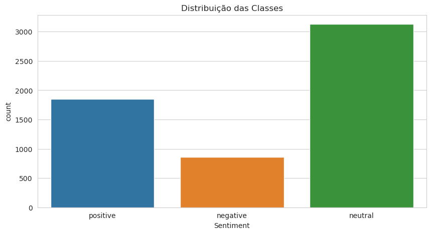
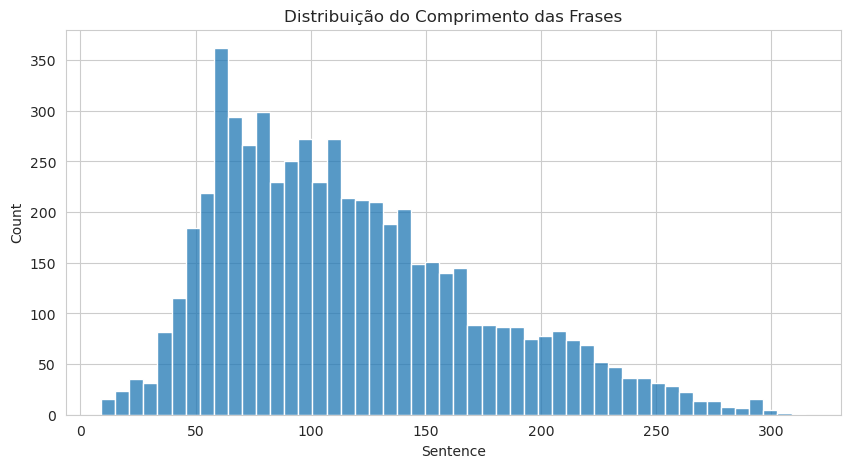
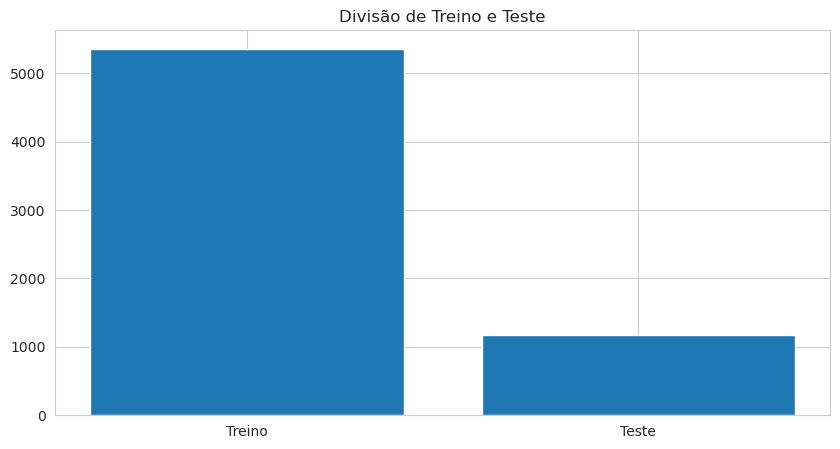
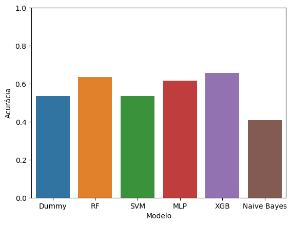
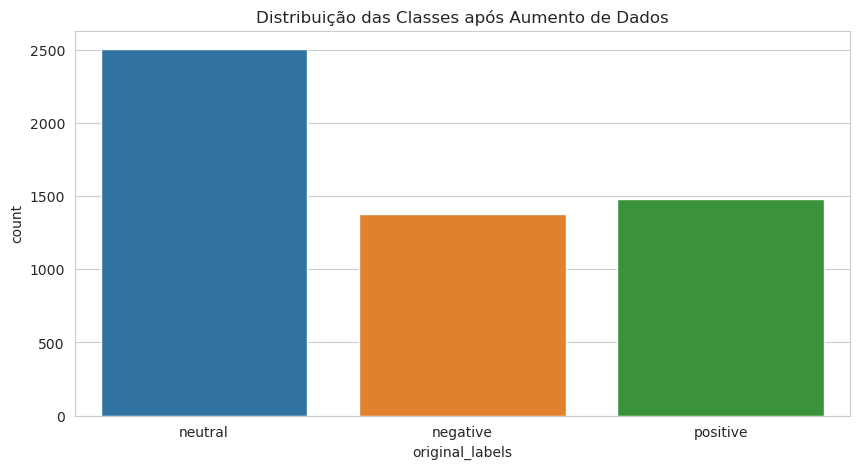
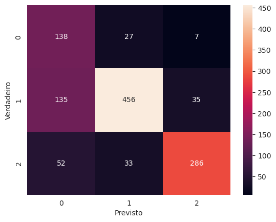

# DemoDay Desafio 2

Este é um projeto do Mandacaru.dev, em que fazemos uma análise e classificação do dataset "Financial Sentiment Analysis" disponível em: https://www.kaggle.com/datasets/sbhatti/financial-sentiment-analysis.
## Abordagem clássica em aprendizado de máquina:

### Seção 1: Pré-processamento dos dados

O pré-processamento dos dados é uma parte fundamental do NLP, para o tratamento dos nossos dados iremos usar: 

1 - Remoção de linhas nulas/vazias. 
2 - Remoção de alfanuméricos. 
3 - Conversão em palavras minúsculas. 
4 - Remoção de pontuações e stopwords. 
5 - Lemmatização 
6 - Divisão de treino/teste 
7 - Codificação da variável target 
8 - Vetorização dos dados via TF/IDF 

### Seção 1.5: Análise Exploratória de Dados

A análise exploratória de dados é uma parte fundamental do processo de análise de dados, para isso usamos: 
- Gráfico de barras para visualizar:
    - Distribuição das classes. 
    
    - Distribuição do comprimento das frases. 
    
    - Distribuição treino/teste. 
    

- Nuvem de palavras para visualizar as palavras mais frequentes. 

### - Seção 2: Treinamento do modelo

Para o treinamento do modelo usaremos 80% do dataset, e 20% para o teste.  
Usamos os seguintes classificadores: (SVM, Random Forest, XGBoost, MLP, Naive Bayes).  
Também implementamos o otimização Gridsearch nos modelos citados acima e otimizamos os parametros do tokenizador tf-idf, também utilizanod busca exaustiva.

### - Seção 3: Avaliação dos Modelos

Os modelos antes do tuning apresentaram os seguintes resultados: (Note que DUMMY é um modelo que chuta a classe mais frequente) 

|  **Modelo** | **Acurácia** |
|:-----------:|:------------:|
|       Dummy |     0.535775 |
|          RF |     0.634885 |
|         SVM |     0.535775 |
|         MLP |     0.615200 |
|         XGB |     0.657480 |
| Naive Bayes |     0.407395 |

Notando que o modelo que apresentou melhor acurácia foi o XGBoost, o mesmo foi escolhido para o tunning do tokenizador.  

Após o tuning dos modelos, os resultados foram os seguintes:

## Abordagem usando o Modelo de Aprendizado Profundo(BERT)

### Seção 1: Importações e Leitura de Dados**
- Realiza importações necessárias, incluindo bibliotecas como NumPy, Pandas, Transformers e outras.
- Lê os dados de um arquivo CSV chamado "data.csv".

### Seção 1.5: Análise Exploratória de Dados**
- Realiza análise exploratória dos dados, gerando gráficos para visualizar a distribuição das classes, o comprimento das frases e uma nuvem de palavras.

### Seção 2: Pré-processamento e Tokenização**
- Remove linhas com valores nulos.
- Atualiza os rótulos usando um codificador de rótulos.
- Divide os dados em conjuntos de treinamento e teste.
  
### Seção 2.5: Aumento de Dados**
- Aumenta os dados para a classe menos dominante substituindo palavras por seus sinônimos.
  
### Seção 2.7: Análise após Aumento de Dados e Tokenização**
- Adiciona uma nova coluna com os nomes originais das classes.
- Gera gráficos para visualizar a distribuição das classes após o aumento de dados e a divisão entre treino e teste.

O seguinte gráfico mostra a distribuição das classes após o aumento de dados:

### Seção 3: Classe do Conjunto de Dados**
- Define uma classe de conjunto de dados para manipular os dados durante o treinamento do modelo.

### Seção 4: Parâmetros do Modelo**
- Define a arquitetura do modelo usando BERT pré-treinado.
- Configura otimizador, critério de perda e agendador de taxa de aprendizado.

### Seção 5: Funções Auxiliares**
- Implementa funções auxiliares para verificar a acurácia e calcular a acurácia média.

### Seção 6: Treinamento com Validação Cruzada**
- Realiza o treinamento do modelo usando validação cruzada e estratificação.
- Armazena perdas de treinamento e validação para cada dobra.

### Seção 6.5: Gráfico de Perda de Treinamento e Acurácia de Validação**
- Gera um gráfico para visualizar as perdas de treinamento e a acurácia de validação ao longo das épocas e dobras.

### Seção 7: Testando o Modelo**
- Avalia o modelo no conjunto de teste final.
- Calcula a precisão de teste e imprime um relatório de classificação e uma matriz de confusão.

| **precision** | **recall** | **f1-score** | **support** |  |
|:---:|:---:|:---:|:---:|---|
| Negativo | 0.42 | 0.80 | 0.56 | 172 |
| Neutro | 0.88 | 0.73 | 0.80 | 626 |
| Positivo | 0.87 | 0.77 | 0.82 | 371 |
|---  | ---  | --- | --- | --- |
| **accuracy** | **0.75** | 1169 | --- | --- |
| **macro avg** | 0.73 | 0.77 | 0.72 | 1169 |
| **weighted avg** | 0.81 | 0.75 | 0.77 | 1169 |

### Seção 8: Salvando o Modelo, Tokenizador e Encoder**
- Salva o modelo treinado, o tokenizador BERT e o codificador de rótulos para uso futuro.
