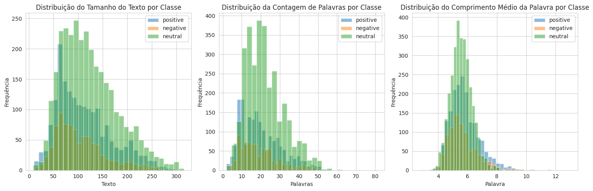
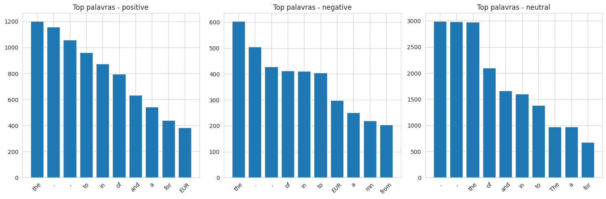
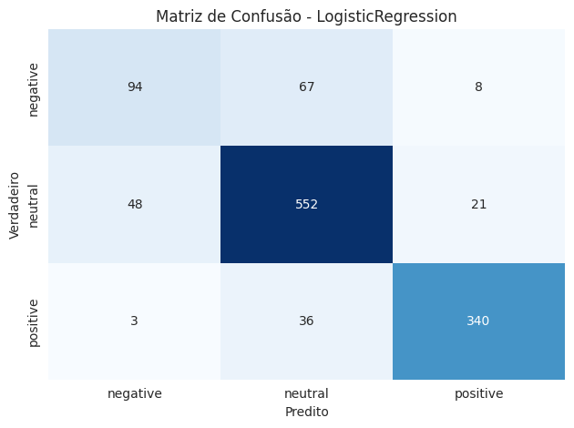
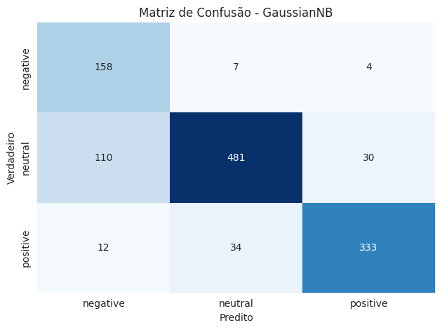
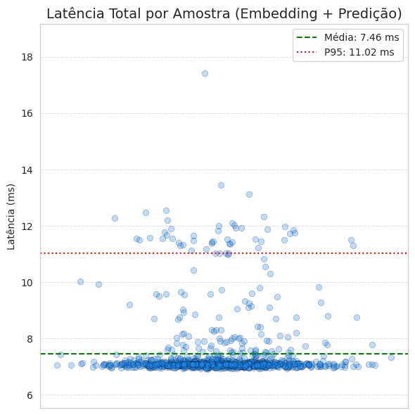

# Classificador de Sentimentos para Notícias do Mercado Financeiro

## Visão Geral e Objetivo de Negócio

Na era da informação, empresas do setor financeiro enfrentam o desafio de extrair insights de vastos volumes de dados para tomar decisões estratégicas. A análise de sentimentos de notícias surge como uma ferramenta poderosa para monitorar a percepção pública e a reputação de uma marca em tempo real.

Este projeto atende ao desafio de desenvolver um **classificador de sentimentos eficiente, preciso e escalável**. O objetivo é criar uma solução de ponta a ponta (end-to-end) que analisa o texto de uma notícia e o classifica como **positivo, negativo ou neutro**, fornecendo uma base de dados para que uma empresa possa:

* Avaliar a própria reputação e a de concorrentes.
* Criar rankings de percepção de mercado.
* Compreender a imagem que projeta perante a sociedade e investidores.

O modelo final foi implantado como uma solução de produto por meio de uma API REST interativa, demonstrando sua aplicabilidade prática em um cenário de negócios.


---

## TOC

* [Perspectiva Analítica](#-perspectiva-analítica-o-ciclo-de-ds)
    * [1. Análise Exploratória dos Dados](#1-análise-exploratória-dos-dados-eda)
    * [2. Pré-processamento e Preparação dos Dados](#2-pré-processamento-e-preparação-dos-dados)
    * [3. Modelagem e Otimização de Hiperparâmetros](#3-modelagem-e-otimização-de-hiperparâmetros)
    * [4. Validação e Avaliação de Performance](#4-validação-e-avaliação-de-performance)
    * [5. Interpretabilidade do Modelo](#5-interpretabilidade-do-modelo)
* [Perspectiva de Produto (A Solução em Produção)](#-perspectiva-de-produto-a-solução-em-produção)
    * [API REST com Flask e StreamLit](#api-rest-com-flask-e-streamlit)
* [Reprodutibilidade e Escalabilidade](#️-reprodutibilidade-e-escalabilidade)
* [Tecnologias Utilizadas](#️-tecnologias-utilizadas)
* [Estrutura do Repositório](#-estrutura-do-repositório)

---

## Perspectiva Analítica

Esta seção detalha o desenvolvimento do modelo, abordando a análise exploratória, engenharia de atributos, modelagem e validação.

### 1. Análise Exploratória dos Dados (EDA)
A análise completa se encontra no notebook [`analise_e_engFeatures.ipynb`](./notebooks/analise_e_engFeatures.ipynb).

#### Base de Dados

A base de dados utilizada para este trabalho foi a [Financial Sentiment Analysis](https://www.kaggle.com/datasets/sbhatti/financial-sentiment-analysis), disponível no Kaggle.
É uma base de dados que originada de um [artigo científico](https://arxiv.org/pdf/1307.5336) que propõe técnicas para classificação de sentimentos em notícias financeiras.

A base é composta por um subconjunto de dois datasets (FiQA, Financial PhraseBank), anotados por 16 especialistas. O rótulo atual representa um consenso de 50% dos especialistas. Diante disso, nota-se que o dataset pode apresentar um nível não nulo de ruído ou mislabeling.
Logo, nota-se que o dataset pode apresentar um nível não nulo de ruído, ou mislabeling. 

* **Dataset:** Composto por 5842 sentenças rotuladas por especialistas do setor financeiro.
* **Classes:** Positivo, Negativo e Neutro.
* **Distribuição de Classes:** Apresenta desbalanceamento, onde a classe minoritária (negativo) representa apenas 14.7% das amostras totais. Esta característica guiou a escolha da métrica de avaliação F1-Score.

    


#### Análise dos Dados

Inicialmente, visualizamos a distribuição das classes pelo Tamanho do Texto, Contagem de Palavras e Comprimento Médio de cada Palavra, como mostra a imagem abaixo:


Nota-se, então:
* A grande massa dos textos tem entre 60 e 120 caracteres. E as classes negativa e positiva apresentam uma distribuição semelhante, enquanto a classe neutra apresenta uma distribuição mais ampla, com textos mais longos.
* A contagem de palavras apresenta uma distribuição similar, com a maioria dos textos contendo entre 10 e 30 palavras. A classe neutra novamente apresenta uma distribuição mais ampla, com textos mais longos.
* O comprimento médio das palavras é relativamente constante entre as classes, com uma leve tendência de palavras mais longas na classe positiva.

Ao analisar as palavras, ou elementos, mais frequentes em cada classe, não existe um padrão claro. Os elementos mais frequentes estão presentes em todas as classes e são elementos insignificantes, como artigos, preposições e sinais.



 Ao analisar os termos com maior score com TF-IDF, foi possível identificar palavras mais relevantes para cada classe, removendo termos muito repetitivos em todas as frases:

| Classe       | Palavras com Maior Score (Ordenadas por Score)                                               |
| ------------ |----------------------------------------------------------------------------------------------|
| **Positiva** | "eur", "sales", "year", "mn", "long", "company", "net", "profit", "http", "http stks"        |
| **Neutra**   | "eur", "company", "finland", "million", "mn", "said", "shares", "sales", "value", "business" |
| **Negativa** | "eur", "mn", "profit", "sales", "eur mn", "year", "https", "operating", "quarter", "net"     |

Nota-se que a palavra "eur" é a mais frequente em todas as classes, indicando que o dataset é composto por notícias financeiras europeias. 

As palavras "sales" e "mn" também são comuns, sugerindo que o dataset contém informações sobre vendas e lucros de empresas, como esperado.

Finalmente, nota-se que "profit" aparece com maior score no sentimento negativo do que no positivo. Isso pode nos indicar que contexto é algo importante para a classificação, e que o modelo deve ser capaz de entender o contexto em que as palavras são usadas.

#### Construção de Atributos e Teste de Hipóteses

Como os atributos textuais brutos não parecem ser suficientes para capturar o contexto e nuances do jargão financeiro, podemos explorar a criação de atributos adicionais. 

Alguns atributos manuais foram construídos como: comprimento_texto, num_palavras, comprimento_medio_palavra, tamanho_texto, qtd_palavras, qtd_exclamacao, qtd_interrogacao, razao_caixa_alta;

Também foi utilizado conhecimento prévio do domínio para criar atributos adicionais, com uso do Dicionario Loughran-McDonald, que é um dicionário especializado em termos financeiros, que ajuda a identificar palavras com conotação positiva ou negativa no contexto financeiro.

Assim, foram criados atributos adicionais para cada frase, como: qtd_palavras_positivas, qtd_palavras_negativas, qtd_palavras_incerteza, qtd_palavras_litigiosas, qtd_palavras_limitantes e o score de sentimento, que é a diferença entre a quantidade de palavras positivas e negativas.

Com esses atributos, podemos realizar um teste de hipótese de Kruskal-Wallis para verificar se há diferenças significativas entre a mediana das classes.

| Atributo                    | Conclusão         |
| --------------------------- | ----------------- |
| comprimento\_texto          | Significativo     |
| num\_palavras               | Significativo     |
| comprimento\_medio\_palavra | Significativo     |
| tamanho\_texto              | Significativo     |
| qtd\_palavras               | Significativo     |
| qtd\_exclamacao             | Significativo     |
| qtd\_interrogacao           | Significativo     |
| razao\_caixa\_alta          | Significativo     |
| qtd\_palavras\_positivas    | Significativo     |
| qtd\_palavras\_negativas    | Significativo     |
| qtd\_palavras\_incerteza    | Não Significativo |
| qtd\_palavras\_litigiosas   | Não significativo |
| qtd\_palavras\_limitantes   | Não significativo |
| score\_sentimento           | Significativo     |

Apesar de serem significativos, podemos ter certeza de que são úteis para classificação ao analisar a informação associada quando rodamos em um modelo de Árvore de Decisão. 

Abaixo mostra-se a importância de cada atributo para a classificação, juntamente com as palavras de TF-IDF, para verificar quais são relevantes:

| Atributo                    | Importância |
| --------------------------- | ----------- |
| score\_sentimento           | 0.0359      |
| razao\_caixa\_alta          | 0.0340      |
| qtd\_palavras\_negativas    | 0.0286      |
| comprimento\_medio\_palavra | 0.0276      |
| tamanho\_texto              | 0.0233      |
| comprimento\_texto          | 0.0228      |
| num\_palavras               | 0.0208      |
| qtd\_palavras               | 0.0183      |
| qtd\_palavras\_positivas    | 0.0145      |
| sales                       | 0.0073      |

Apesar das features manuais serem as mais importantes, com exceção de "sales" (TF-IDF), nota-se que nenhuma tem importância alta; logo, as features podem não ser muito úteis para a classificação.

#### Conclusões da EDA

Análise Exploratória dos Dados revelou dois desafios centrais: o desbalanceamento das classes, com a categoria "negativa" sendo minoritária (14,7%), e a forte dependência de contexto do linguajar financeiro. 
A análise mostrou que palavras-chave como "profit" (lucro) podem aparecer em sentenças de sentimentos opostos, indicando que abordagens que não consideram o contexto da frase estão propensas a erros.

Para contornar essa limitação, foi realizada uma etapa de engenharia de atributos, criando características baseadas em léxicos financeiros (como um score de sentimento) e em padrões textuais. Esses novos atributos se mostraram mais informativos que a simples frequência de palavras (TF-IDF). 
Contudo, como nenhum atributo isoladamente possui alto poder preditivo, a análise reforça que um modelo de sucesso deve ser capaz de aprender com a combinação complexa de múltiplas features, em vez de depender de regras ou palavras-chave simples.


### 2. Pré-processamento e Preparação dos Dados

Com base na análise, notamos que será necessário realizar um pré-processamento das frases para reduzir o ruído e elementos textuais não informativos. Assim, para preparar os dados para os modelos, foi executado um pipeline de limpeza textual com os seguintes passos:

* Conversão das sentenças para letras minúsculas.
* Remoção de dígitos numéricos.
* Remoção de pontuação, exceto os sinais de exclamação e interrogação, uma vez que parecem relevantes para a classificação.
* Remoção de *stopwords* com base no idioma especificado.
* Lematização, reduzindo as palavras à sua forma canônica (e.g., "improving" → "improve").

Com isso, as frases apresentam o seguinte formato antes e depois do pré-processamento:

| Frase Original                                                       | Frase Processada                               |
| -------------------------------------------------------------------- |------------------------------------------------|
| `The company's revenue increased by 15% in Q3, profits are soaring.` | `company revenue increase q3 profit soar !`    |
| `The financial markets increased by 15% in 2023!`                    | `financial market increase !`                  |
| `Investors aren't sure whether to buy or sell now.`                  | `investor sure buy sell`                       |
| `GDP growth slowed down significantly during the last quarter.`      | `gdp growth slowed significantly last quarter` |
| `Unemployment has dropped below 4%!`                                 | `unemployment dropped!`                        |


### 3. Modelagem

Foram explorados e comparados múltiplos algoritmos para garantir a escolha da solução mais performática. A síntese dos experimentos está disponível no notebook [`modelagem.ipynb`](./notebooks/modelagem.ipynb).

Os modelos foram avaliados com base na sua acurácia e f1-score, utilizando validação cruzada para garantir a robustez dos resultados. Foram testados os seguintes modelos:

Regressão Logística, SVM, Naive Bayes, KNN, Decision Tree, Random Forest e Gaussian Naive Bayes. Também foi testando um modelo "Dummy", que serve como baseline, onde o modelo sempre prevê a classe majoritária.

Para cada modelo, foram testadas diferentes combinações de atributos, incluindo:

* Doc2Vec
* Bag of Words (BoW)
* Features Manuais
* TF-IDF
* TF-IDF + Features Manuais
* Embeddings: MiniLM, MPNet, finbert-sentiment (Disponível no Hugging Face)
* TF-IDF + Finbert-Sentiment

### 4. Validação e Avaliação de Performance

O desempenho foi medido com rigor, utilizando validação cruzada para garantir a generalização do modelo.

* **Métricas:** Acurácia/F1-Score, ideal para cenários com classes desbalanceadas.
* **Resultados:** O modelo com embedding Finbert-Sentiment superou as demais abordagens com uma margem significativa. 


| Modelo ↓ / Features →            | **Doc2Vec**    | **Bag of Words**  | **Manuais**    | **TF-IDF**     | **TF-IDF + Manuais** | **Embedding: <br> MiniLM** | **Embedding: <br> MPNet** | **Embedding: <br> Finbert-Sentiment** | **TF-IDF + FinBert** |
| -------------------------------- | -------------- |-------------------| -------------- | -------------- | -------------------- | -------------------------- |---------------------------| ------------------------------------- |----------------------|
| **Dummy**                        | 53.69% / 23.28 | 53.69% / 23.28    | 53.69% / 23.28 | 53.69% / 23.28 | 53.69% / 23.28       | 53.69% / 23.28             | 53.69% / 23.28            | 53.69% / 23.28                        | 53.69% / 23.28       |
| **Logistic Regression**          | 59.45% / 43.72 | 64.88% / 55.11    | 61.69% / 48.85 | 65.63% / 53.68 | 65.65% / 57.50       | 71.97% / 65.06             | 75.41% / 68.67            | **80.85% / 74.87**                    | 79.44% / 72.99       |
| **Gaussian NB**                  | 44.53% / 41.00 | 44.85% / 43.31    | 60.24% / 45.99 | 43.61% / 43.25 | 42.37% / 42.13       | 66.13% / 62.17             | 73.96% / 70.81            | **81.79% / 79.87**                    | 64.69% / 63.26       |
| **Linear Discriminant Analysis** | 60.11% / 46.95 | 56.99% / 50.19    | 61.61% / 50.74 | 64.67% / 56.57 | 67.07% / 60.04       | 71.00% / 65.42             | 74.73% / 69.64            | **80.27% / 75.38**                    | 78.11% / 72.49       |
| **K-Nearest Neighbors**          | 55.75% / 46.03 | 53.01% / 43.44    | 50.97% / 39.33 | 54.02% / 45.18 | 55.15% / 46.31       | 65.53% / 56.77             | 69.40% / 61.42            | 78.51% / 72.59                        | **78.96% / 73.22**   |
| **Decision Tree (CART)**         | 47.96% / 40.53 | 57.71% / 51.06    | 45.00% / 38.01 | 54.14% / 46.66 | 55.47% / 48.18       | 48.88% / 41.89             | 54.21% / 46.49            | 68.69% / 61.88                        | **69.59% / 63.03**   |
| **Random Forest**                | 59.47% / 41.50 | 63.73% / 53.81    | 52.11% / 42.28 | 60.90% / 50.14 | 65.74% / 55.63       | 62.36% / 47.04             | 66.96% / 53.36            | **77.89% / 70.51**                    | 77.83% / 70.44       |


#### Tuning de Hiperparâmetros

Assim, para o modelo que utilizou as features de embedding do Finbert-Sentiment, foi realizado um tuning de hiperparâmetros com o uso de RandomSearchCV, para encontrar a melhor combinação de parâmetros para os modelos: Regressão Logística, Gaussian Naive Bayes e Linear Discriminant Analysis.
Isto resultou, respectivamente, nos seguintes parâmetros e resultados:

| Modelo                           | Parâmetros Otimizados                     | Acurácia   | F1 Score   | Precisão   |  Recall    |
| -------------------------------- | ----------------------------------------- |------------|------------|------------|------------|
| **Regressão Logística**          | `{'penalty': 'l2', 'C': 0.01}`            | **84.00%** | 79.12%     | **80.63%** | 77.97%     |
| **Linear Discriminant Analysis** | `{'solver': 'lsqr', 'shrinkage': 'auto'}` | 82.55%     | 78.27%     | 77.82%     | 78.85%     |
| **Gaussian Naive Bayes**         | `{'var_smoothing': 1e-12}`                | 83.15%     | **81.27%** | 79.77%     | **86.27%** |

A seguir 

Nota-se que o modelo de Regressão Logística apresentou a melhor acurácia, enquanto o Gaussian Naive Bayes teve o melhor F1-Score. 

A seguir estão as matrizes de confusão dos dois melhores modelos:




No entanto, alguns favores devem ser considerados:

* O modelo de Regressão Logística teve uma precisão ligeiramente superior, mas com um recall menor, indicando que ele é mais conservador em suas previsões.
* O modelo de Gaussian Naive Bayes teve um recall significativamente maior, indicando que ele é mais agressivo em suas previsões, mas com uma precisão ligeiramente inferior.
* Ambos modelos apresentaram uma dificuldade em classificar corretamente a classe negativa.

### 5. Interpretabilidade do Modelo

Finalmente, precisamos escolher o modelo que será levado para a API. 

Para um problema de negócio, entender *por que* o modelo toma uma decisão é tão importante quanto a precisão. Como estamos usando um modelo Black Box para gerar as features, a interpretabilidade será considerada pela
interpreção das probilidades de ser uma certa classe, e isso é possivel de forma melhor com o modelo de Regressão Logística, que é mais interpretável do que o Gaussian Naive Bayes. Como pode ser visto no exemplo abaixo:

**Probabilidades de Classes: Gaussian Naive Bayes**
```
Exemplo 1: Probabilidades [0.000%, 100.000%, 0.000%] - Classe Predita: neutral
Exemplo 2: Probabilidades [100.000%, 0.000%, 0.000%] - Classe Predita: negative
Exemplo 3: Probabilidades [0.000%, 0.000%, 100.000%] - Classe Predita: positive`
```

***Probabilidades de Classes: Regressão Logística**
```
Exemplo 3: Probabilidades [0.215%, 92.832%, 6.953%] - Classe Predita: neutral
Exemplo 4: Probabilidades [22.433%, 32.292%, 45.275%] - Classe Predita: positive
Exemplo 9: Probabilidades [53.583%, 27.761%, 18.656%] - Classe Predita: negative
```

Assim, o modelo de Regressão Logística foi escolhido para ser levado para a API, pois permite uma melhor interpretação das decisões do modelo, o que é crucial para aplicações no setor financeiro.

#### Avaliação da Latência da Predição

Como o modelo será utilizado em uma API, é importante avaliar a latência da predição. Assim, foi medido o tempo médio para prever uma única amostra, isso inclui gerar os embeddings e realizar a predição.
Dessa forma, usando 1000 amostras e rodando em um computador com configurações modestas (RTX 4060 8GB, Ryzen 5700X, 32GB, Ubuntu 22.04), o tempo médio de predição foi de:


* Tempo médio de geração de embedding: 7.3221 (+/- 1.11) ms
* Tempo médio de predição: 0.1373 (+/- 0.04) ms
* Tempo total médio: 7.45 (+/- 1.14) ms

O gráfico abaixo mostra a distribuição do tempo de predição, no qual é possível notar que a maioria das predições leva menos de 8ms, o que é aceitável. 



---

## Perspectiva de Produto

Para demonstrar a aplicabilidade real da solução, o modelo treinado foi exposto através de uma API REST e uma interface web. (Veja o GIF acima para uma demonstração rápida).

A aplicação permite que o usuário insira uma frase e receba a classificação de sentimento em tempo real, com uma interface amigável e intuitiva. Nela, é possível observar a probabilidade de cada classe, e a frase é classificada como positiva, negativa ou neutra.
Esta aplicação pode ser utilizada por empresas do setor financeiro para monitorar a percepção pública de suas marcas e produtos, bem como para analisar a reputação de concorrentes.

Aliada a outras tecnologias, como web scraping para automatizar a coleta de notícias e técnicas de agrupamento para agrupar frases por contexto, a solução pode ser escalada para analisar grandes volumes de dados em tempo real, fornecendo insights valiosos para a tomada de decisões estratégicas.

### API REST com Flask e StreamLit

* **Backend:** A API foi construída com **Flask**.
* **Frontend:** A interface de usuário foi criada com **Streamlit**.
* **Código Fonte:** Todo o código da aplicação está em [`src`](./src/).

---

## Como usar:

* **Reprodutibilidade:**
    1.  Clone o repositório: `git clone https://github.com/LucasJLBraz/DataScience_Mandacaru.git`
    2.  Crie um ambiente virtual e ative-o.
    3.  Instale as dependências com `pip install -r requirements.txt`. (Python 3.9 recomendado).
    4.  Baixe a base de dados do Kaggle e coloque o arquivo `data.csv` na pasta `data/raw/`.
    5.  Treine o modelo com `python src/train.py`. Isso irá gerar o modelo treinado e os embeddings necessários para a API.
    
* **API:**
    1. Para iniciar a API, execute `python src/api.py`.
    2.  Em outro terminal, inicie a interface web com `streamlit run src/app.py`.
    3.  Classifique as frases :)
